# Tail Class Description Examples

Total examples: 30

## Example 1: Class 10 - brambling

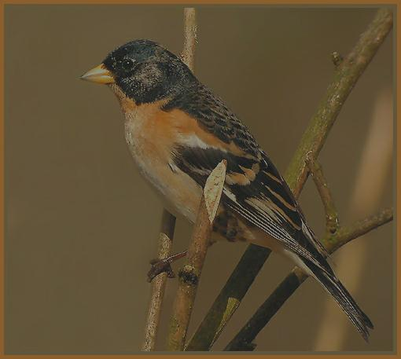

**Description:** A photo of the class brambling, with a bird perched on a tree branch.

---

## Example 2: Class 100 - black swan

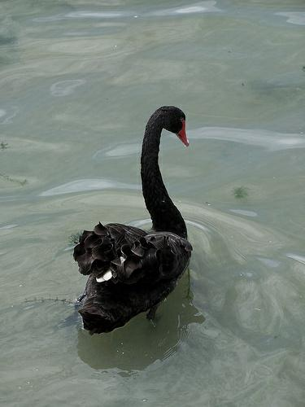

**Description:** A photo of the class black swan, with a red beak and a white spot on its back, swimming in a body of water.

---

## Example 3: Class 102 - echidna

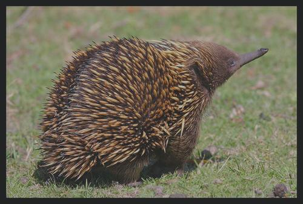

**Description:** A photo of the class echidna, with spiky hairs and a long snout, standing in a grassy field.

---

## Example 4: Class 105 - koala

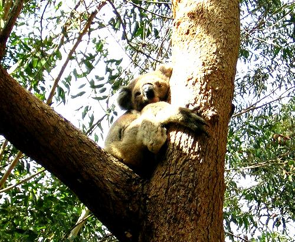

**Description:** A photo of the class koala, with a cute face and a tree branch, in a sunny day.

---

## Example 5: Class 110 - flatworm

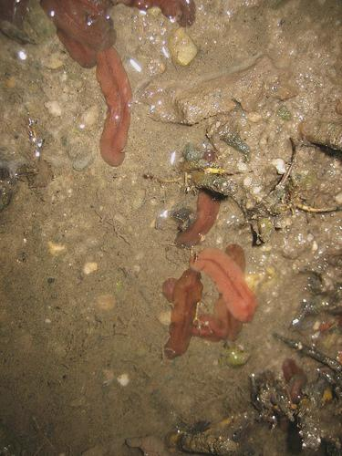

**Description:** A photo of the class flatworm, with red and orange worms in a muddy area.

---

## Example 6: Class 113 - snail

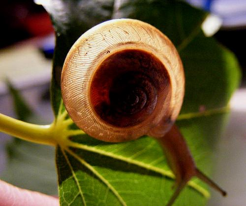

**Description:** A photo of the class snail, with a close up of its shell and leafy background.

---

## Example 7: Class 12 - house finch

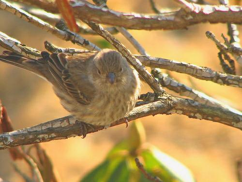

**Description:** A photo of the class house finch, perched on a tree branch.

---

## Example 8: Class 120 - fiddler crab

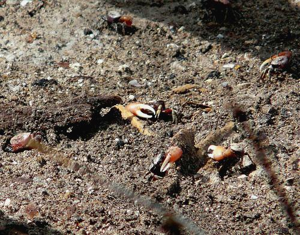

**Description:** A photo of the class fiddler crab, with a dirt ground and a dead crab in the background.

---

## Example 9: Class 122 - American lobster

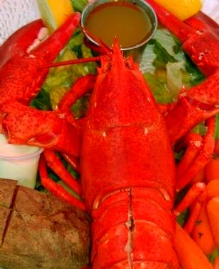

**Description:** A photo of the class American lobster, with a close up of its claws and a bowl of sauce in the background.

---

## Example 10: Class 124 - crayfish

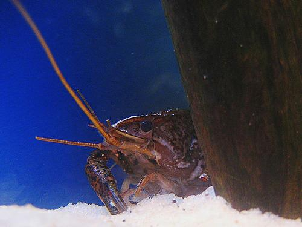

**Description:** A photo of the class crayfish, with a blue background and a sandy area, hiding behind a wooden post.

---

## Example 11: Class 125 - hermit crab

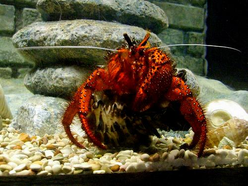

**Description:** A photo of the class hermit crab, with red and orange coloring, and a rocky background.

---

## Example 12: Class 127 - white stork

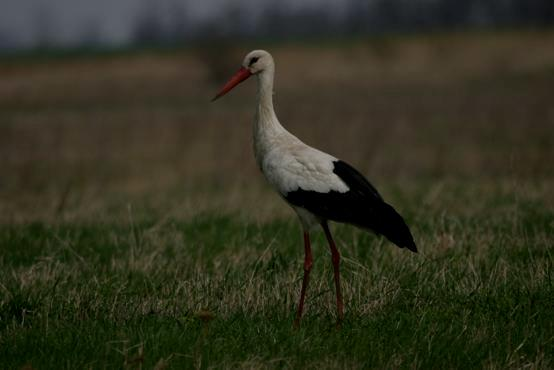

**Description:** A photo of the class white stork, with long legs and a long beak, standing in a grassy field.

---

## Example 13: Class 13 - junco

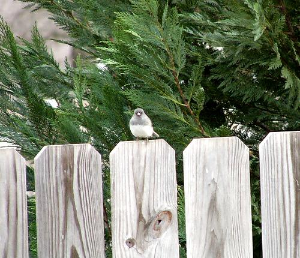

**Description:** A photo of the class junco, perched on a wooden fence.

---

## Example 14: Class 138 - bustard

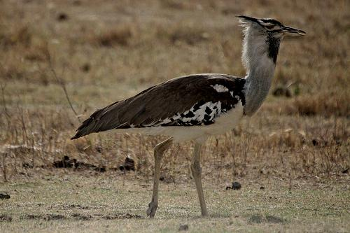

**Description:** A photo of the class bustard, with long legs and a long neck, standing in a grassy field.

---

## Example 15: Class 140 - red-backed sandpiper

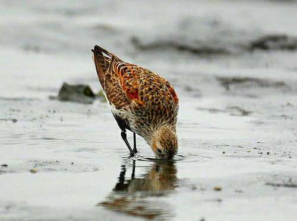

**Description:** A photo of the class red-backed sandpiper, with a brown and white body, standing in shallow water and drinking from it.

---

## Example 16: Class 141 - redshank

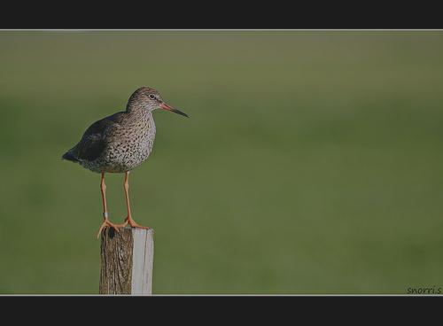

**Description:** A photo of the class redshank, with a brown and black body, standing on a wooden post in a grassy field.

---

## Example 17: Class 142 - dowitcher

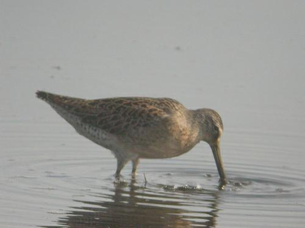

**Description:** A photo of the class dowitcher, with long legs and a long beak, standing in shallow water.

---

## Example 18: Class 144 - pelican

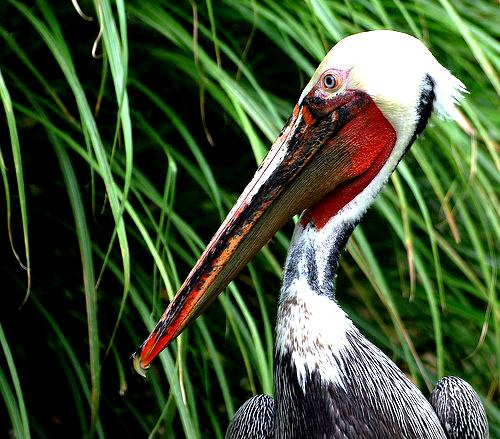

**Description:** A photo of the class pelican, with a long beak and a white head, standing in a grassy area.

---

## Example 19: Class 149 - dugong

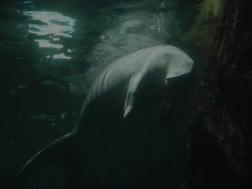

**Description:** A photo of the class dugong, with a close up of its head and a rock in the background.

---

## Example 20: Class 15 - robin

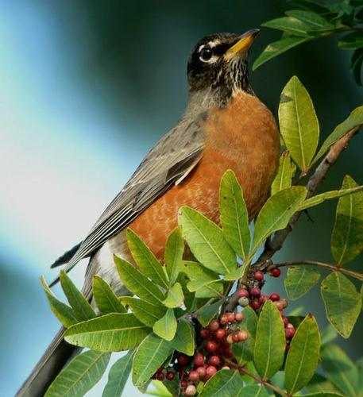

**Description:** A photo of the class robin, with a close up of the bird perched on a branch with berries.

---

## Example 21: Class 152 - Japanese spaniel

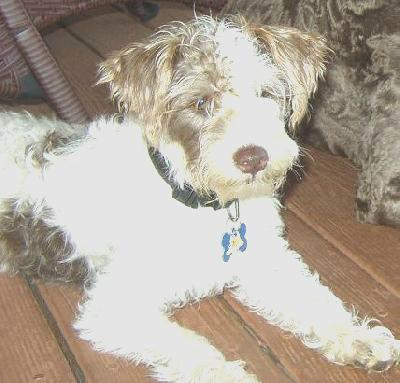

**Description:** A photo of the class Japanese spaniel, with a blue tag on its collar, sitting on a wooden floor.

---

## Example 22: Class 153 - Maltese dog

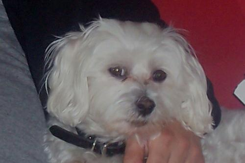

**Description:** A photo of a white Maltese dog with a black collar, sitting on a person's lap.

---

## Example 23: Class 155 - Shih-Tzu

**Description:** A photo of a man holding a small white dog with a brown face.

---

## Example 24: Class 157 - papillon

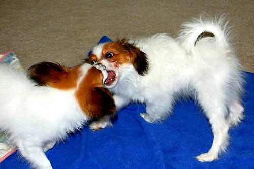

**Description:** A photo of the class papillon, with two dogs playing on a blue blanket.

---

## Example 25: Class 159 - Rhodesian ridgeback

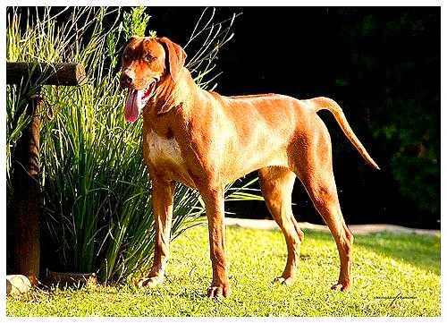

**Description:** A photo of the class Rhodesian ridgeback, with a brown and white dog standing in a grassy field.

---

## Example 26: Class 162 - beagle

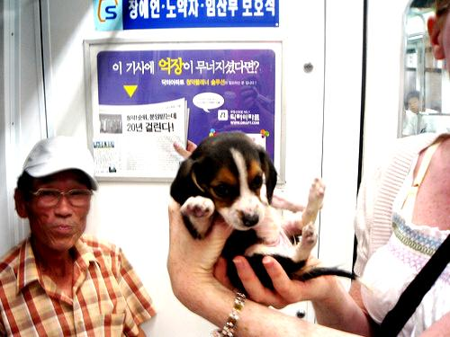

**Description:** A photo of the class beagle, with a person holding the puppy in their hands.

---

## Example 27: Class 163 - bloodhound

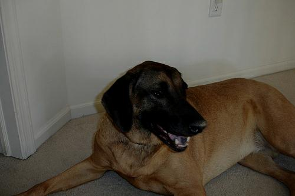

**Description:** A photo of the class bloodhound, with a red collar, laying on the floor.

---

## Example 28: Class 166 - Walker hound

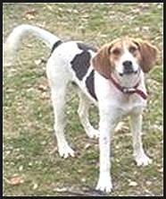

**Description:** A photo of the class Walker hound, with a red collar, standing in a grassy field.

---

## Example 29: Class 167 - English foxhound

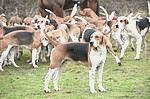

**Description:** A photo of the class English foxhound, with a group of dogs standing in a grassy field.

---

## Example 30: Class 169 - borzoi

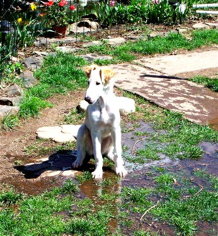

**Description:** A photo of the class borzoi, with a white and brown dog sitting in a puddle of water.

---

